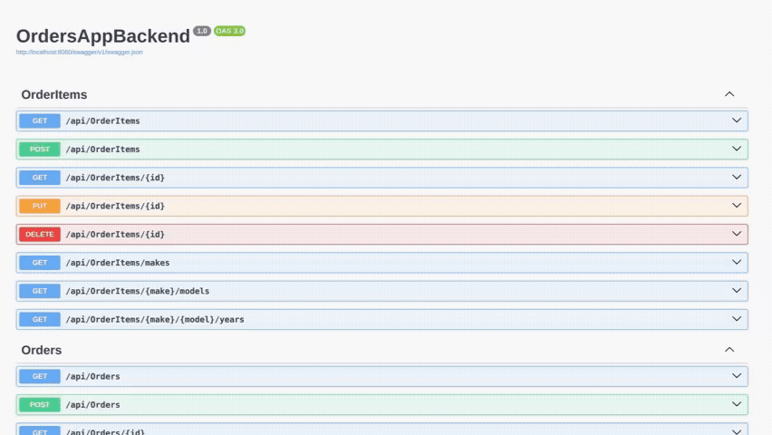

📦 **OrdersApp** é uma aplicação fullstack para gestão de pedidos. O projeto adota uma arquitetura limpa, orquestrando um backend .NET escalável com um frontend Angular focado em experiência do usuário.

### 📌 Acesso Rápido

| Serviço            | URL                           |
| ------------------ | ----------------------------- |
| **Backend API**    | http://localhost:8080         |
| **Swagger (Docs)** | http://localhost:8080/swagger |
| **Frontend**       | http://localhost:4200         |

## Backend (.NET 10)

O núcleo da aplicação é uma API REST em .NET (C#) que prioriza a separação de responsabilidades. A estrutura divide claramente Controllers (pontos de entrada), Services (regras de negócio) e Repositories (acesso a dados).

A persistência de dados é gerenciada pelo SQL Server. Para otimizar a performance, operações pesadas como filtros complexos e cálculos de totalização foram delegadas diretamente ao banco via Stored Procedures e Triggers. Todo o ciclo é validado por testes unitários integrados ao build.

A execução do backend e do banco de dados requer **Docker (v27+)**.

## Frontend (Angular 18)

A interface utiliza Angular 18 e Material Design. Um dos destaques da implementação é a usabilidade nos filtros de pedidos: a seleção em cascata (Marca → Modelo → Ano) carrega as opções dinamicamente conforme a escolha anterior, tudo construído sobre uma arquitetura de componentes modulares.

A execução do frontend requer o ambiente local configurado com **Node.js (v20+)** e **Angular CLI (v18+)**.

## 🛠️ Instalação e Execução

Para iniciar, abra seu terminal na raiz do projeto.

### 1️⃣ Infraestrutura (Backend e Banco)

1. Acesse o diretório do servidor:

```bash
cd OrdersAppBackend
```

2. Defina as variáveis de ambiente:

```bash
cp .env.example .env
```

3. Suba os containers. Ao finalizar (ou em outra aba), retorne ao diretório raiz:

```bash
docker-compose up --build
cd ..
```

O script `database/init.sql` rodará automaticamente para preparar o banco.

### 2️⃣ Interface (Frontend)

1. Acesse o diretório da aplicação web:

```bash
cd orders-app-frontend
```

2. Defina as variáveis de ambiente:

```bash
cp .env.example .env
```

3. Instale as dependências e inicie o servidor:

```bash
npm install
ng serve
```

## ⚖️ Licença

Este projeto é distribuído sob a **Licença MIT**. Você é livre para utilizar e modificar o código. O único requisito é dar o devido crédito.
