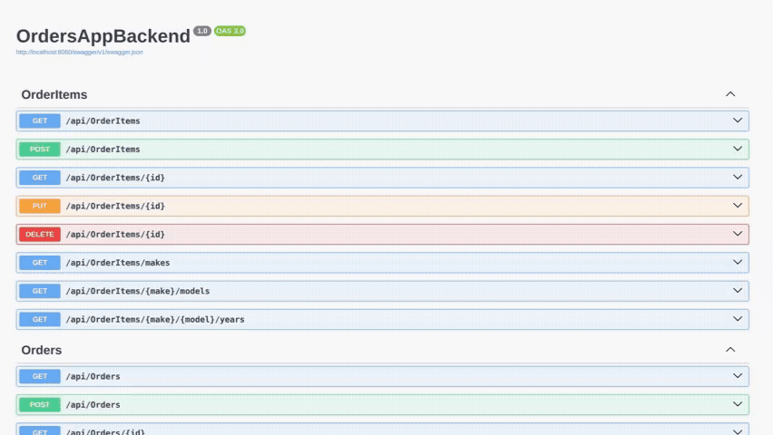

📦 **OrdersApp** é uma aplicação fullstack para gestão de pedidos. O projeto adota uma arquitetura limpa, integrando um backend .NET escalável a um frontend Angular com foco em experiência do usuário.

### 📌 Acesso Rápido

| Serviço                  | URL                                                            |
| ------------------------ | -------------------------------------------------------------- |
| **Swagger (backend)**    | [http://localhost:8080/swagger](http://localhost:8080/swagger) |
| **Interface (frontend)** | [http://localhost:4200](http://localhost:4200)                 |

## 🗄️ Backend


O núcleo da aplicação é uma API REST desenvolvida em C# com .NET 10. A estrutura segue a separação clara de responsabilidades entre Controllers (entrada), Services (regras de negócio) e Repositories (acesso a dados).

A persistência é feita em SQL Server. Para melhor desempenho, operações mais custosas são executadas diretamente no banco por meio de um trigger e uma stored procedure, declarados respectivamente em `003_create_automatic_totalization_trigger.sql` e `004_create_filtered_search_stored_procedure.sql`. Todo o fluxo é validado por testes unitários integrados ao processo de build.

A execução do backend e do banco de dados requer **Docker (v27+)**.

## 🖥️ Frontend


A interface foi desenvolvida com Angular 18 e Angular Material. Um dos principais destaques é o sistema de filtros de pedidos com seleção em cascata (Marca → Modelo → Ano), com carregamento dinâmico conforme a seleção anterior.

O código segue uma arquitetura baseada em componentes modulares.

A execução do frontend requer **Node.js (v20+)** e **Angular CLI (v18+)**.

## 🛠️ Instalação e Execução

Abra um terminal na raiz do projeto.

### 1️⃣ Infraestrutura (Backend e Banco)

1. Acesse o diretório do backend:

```bash
cd OrdersAppBackend
```

2. Defina as variáveis de ambiente:

```bash
cp .env.example .env
```

3. Suba os containers:

```bash
docker compose up -d
```

4. Retorne ao diretório raiz:

```bash
cd ..
```

Os scripts em `_database/scripts/` são executados automaticamente, criando o banco de dados, tabelas, trigger, stored procedure e populando o ambiente com dados fictícios.

### 2️⃣ Interface (Frontend)

1. Acesse o diretório do frontend:

```bash
cd orders-app-frontend
```

2. Instale as dependências:

```bash
npm install
```

3. Inicie a aplicação:

```bash
ng serve
```

## ⚖️ Licença

Este projeto é distribuído sob a **Licença MIT**. O uso, modificação e redistribuição são permitidos, desde que os devidos créditos sejam mantidos.
